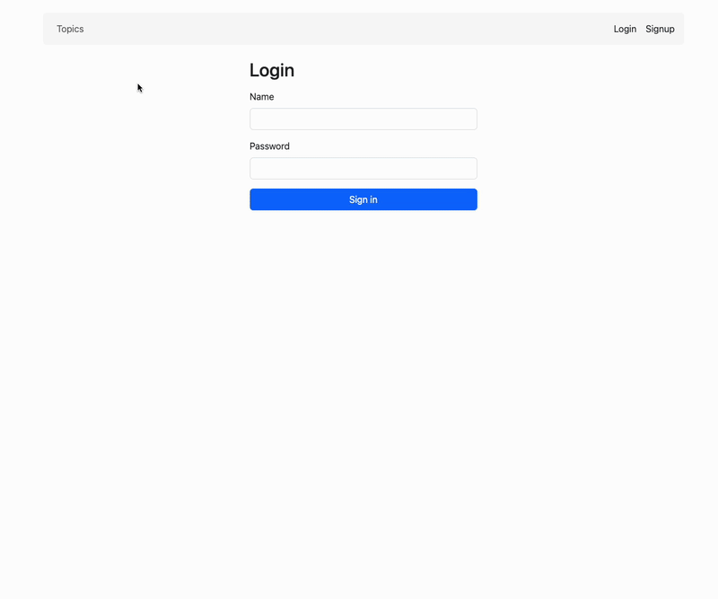

# Skills-Hab

Skills-Hab is a full-stack tutoring platform where:
- **Tutors** create and manage services by topic.
- **Students** browse services and create learning requests.

## Demo



## Tech Stack

### Frontend
- React 18
- React Router 6
- Bootstrap 5
- Formik + Yup

### Backend
- Flask + Flask-RESTful
- Flask-Login
- SQLAlchemy + Flask-Migrate
- Marshmallow
- SQLite

## Prerequisites

- Python + Pipenv
- Node.js (LTS recommended)

## Setup (from project root)

### 1) Backend

```bash
pipenv install
pipenv shell
```

### 2) Environment Setup

Create a `.env` file in the `server/` directory:

```bash
cp server/.env.example server/.env
```

Generate a secure secret key and add it to `server/.env`:

```bash
python -c "import secrets; print(secrets.token_hex(32))"
```

Copy the output and replace `your-secret-key-here` in `server/.env`:

```
SECRET_KEY=your-generated-key
```

### 3) Run Backend

```bash
python server/app.py
```

Backend runs at: `http://localhost:5555`

### 4) Frontend

```bash
npm install --prefix client
npm start --prefix client
```

Frontend runs at: `http://localhost:3000`

## Main Routes

Defined in [client/src/router.js](client/src/router.js).

### Public
- `/` — Home
- `/login`
- `/signup`

### Protected
- `/tutor_topics` — tutor services dashboard
- `/student_topics` — student requested topics/services
- `/student/topic/:topicId/service/:serviceId/requests` — student request history for one service
- `/tutor/topic/:topicId/service/:serviceId/requests` — tutor request list for one service
- `/topic/:topicId/service/:serviceId/request` — open the request modal for a specific service

## API Endpoints 

Defined in [server/app.py](server/app.py).

- `POST /login`
- `POST /signup`
- `GET /check_session`
- `DELETE /logout`
- `GET /topics`
- `POST /topics`
- `POST /tutor_services`
- `PATCH /tutor_services/:id`
- `DELETE /tutor_services/:id`
- `POST /requests`
- `POST /requests/:id` (status update)

## Feature Overview

### Student Flow
1. Browse topics/services on Home.
2. Click **Request** to open route-driven request form.
3. Submit request.
4. Redirect to request history page for that service.

### Tutor Flow
1. Open tutor topics dashboard.
2. Add or manage services.
3. Open service requests page.
4. Accept/reject requests.


## Project Structure

```text
client/
    src/
        context/
        features/
            auth/
            shared/
            student/
            tutor/
        router.js
server/
    app.py
    config.py
    models.py
    schemas.py
    migrations/
```

## Notes

- The client uses `proxy` in [client/package.json](client/package.json) to forward API requests to the backend.
- Auth/session state is loaded through `/check_session` in [client/src/context/DataContext.js](client/src/context/DataContext.js).
